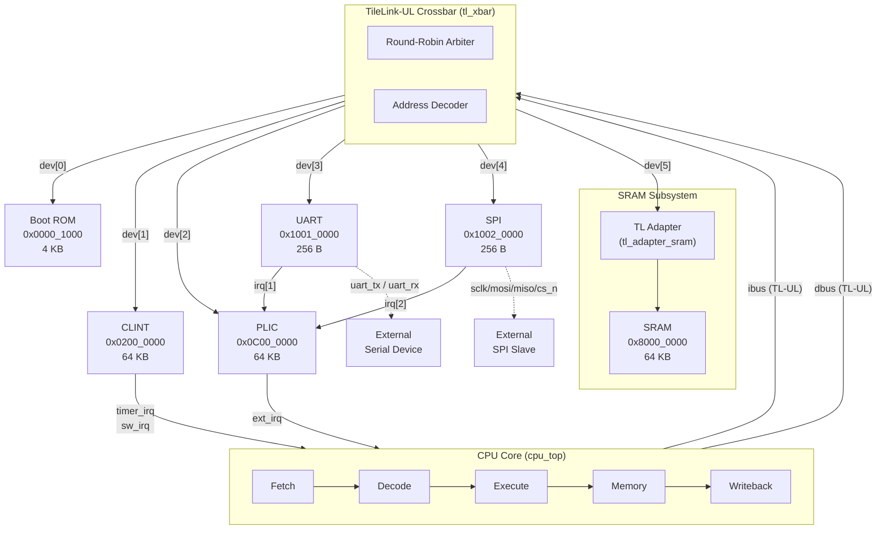

# Custom RV32IMC System-on-Chip (SoC)

A fully synthesizable, 32-bit RISC-V System-on-Chip built from scratch in SystemVerilog. Features a 5-stage pipelined CPU core with M and C extensions, a TileLink-UL crossbar interconnect, and a complete peripheral set — all designed for Xilinx Vivado synthesis and simulation.

---

## SoC Architecture Diagram



## Key Features

| Feature         | Details                                                                 |
|-----------------|-------------------------------------------------------------------------|
| **ISA**         | RV32IMC (Base Integer + Multiply/Divide + Compressed)                   |
| **Pipeline**    | 5-stage in-order (Fetch → Decode → Execute → Memory → Writeback)        |
| **Privilege**   | Machine-mode (M-mode) only                                             |
| **Bus**         | TileLink-UL (Uncached Lightweight), valid/ready handshake               |
| **Crossbar**    | 2 Hosts (ibus + dbus) → 6 Devices, round-robin arbitration             |
| **RAM**         | 64 KB SRAM (infers BRAM on Xilinx)                                      |
| **Boot ROM**    | 4 KB, loaded at synthesis via `.hex` file                               |
| **UART**        | 8N1, configurable baud, 16-entry TX/RX FIFOs, interrupt support         |
| **SPI**         | Master, configurable CPOL/CPHA, 8-bit transfers, interrupt support      |
| **CLINT**       | 64-bit `mtime` / `mtimecmp`, `msip` software interrupt                 |
| **PLIC**        | 8 sources, 7 priority levels, threshold-based gating, claim/complete    |
| **CSRs**        | Full M-mode set: `mstatus`, `mie/mip`, `mtvec`, `mepc`, `mcause`, etc. |
| **Counters**    | 64-bit `mcycle` and `minstret` hardware performance counters            |
| **Reset Vector**| `0x0000_1000` (Boot ROM)                                                |

## Directory Structure

```text
SoC/
├── rtl/
│   ├── include/
│   │   ├── rv32_defs.svh          # Opcodes, ALU enums, CSR addresses, exception codes
│   │   └── tl_ul_defs.svh         # TileLink-UL bus struct types (tl_h2d_t, tl_d2h_t)
│   ├── core/
│   │   ├── cpu_top.sv             # CPU top-level: pipeline wiring, stall/flush control
│   │   ├── fetch.sv               # PC generation, instruction memory interface
│   │   ├── compressed_decoder.sv  # RV32C → RV32I instruction expansion (all 3 quadrants)
│   │   ├── decode.sv              # Full RV32IMC decoder (R/I/S/B/U/J + SYSTEM)
│   │   ├── execute.sv             # ALU operand muxing, branch resolution, target computation
│   │   ├── alu.sv                 # Combinational ALU: ADD/SUB/AND/OR/XOR/SLL/SRL/SRA/SLT/SLTU
│   │   ├── muldiv.sv             # Iterative 32-cycle multiply (shift-add) / divide (restoring)
│   │   ├── mem_stage.sv           # Data bus TL-UL interface, byte-enable and sign-extension
│   │   ├── writeback.sv           # WB mux: ALU | MEM | PC+4 | CSR | MulDiv
│   │   ├── regfile.sv             # 32x32 register file, write-first forwarding, x0=0
│   │   └── csr.sv                 # M-mode CSRs, trap/interrupt handler, ECALL/EBREAK/MRET
│   ├── bus/
│   │   ├── tl_xbar.sv            # 2-host → N-device crossbar with address decoding
│   │   └── tl_adapter_sram.sv    # TL-UL ↔ SRAM bridge (byte addr → word addr conversion)
│   ├── mem/
│   │   ├── boot_rom.sv           # 256-word ROM, loaded via $readmemh, TL-UL interface
│   │   └── sram.sv               # Parameterized byte-enable SRAM (infers Xilinx BRAM)
│   ├── periph/
│   │   ├── clint.sv              # mtime/mtimecmp/msip registers
│   │   ├── plic.sv               # Priority-based interrupt controller with claim/complete
│   │   ├── uart/
│   │   │   ├── uart_top.sv       # UART with TL-UL register interface
│   │   │   ├── uart_baud_gen.sv  # Configurable baud rate tick generator
│   │   │   ├── uart_fifo.sv      # Parameterized synchronous FIFO
│   │   │   ├── uart_tx.sv        # UART transmitter (shift register + start/stop bits)
│   │   │   └── uart_rx.sv        # UART receiver (oversampling + shift register)
│   │   └── spi/
│   │       ├── spi_top.sv        # SPI master with TL-UL register interface
│   │       ├── spi_clkgen.sv     # SPI clock divider with CPOL support
│   │       └── spi_master.sv     # 8-bit SPI shift engine with CPHA support
│   └── soc_top.sv                # Top-level SoC: instantiates all modules, defines memory map
├── tb/
│   ├── tb_cpu.sv                 # CPU-level testbench
│   ├── tb_soc.sv                 # Full SoC testbench
│   ├── tb_alu.sv                 # ALU unit test
│   ├── tb_regfile.sv             # Register file unit test
│   ├── tb_uart.sv                # UART peripheral test
│   └── tb_spi.sv                 # SPI peripheral test
└── docs/
    ├── core.md                   # CPU pipeline deep-dive
    ├── bus_memory.md             # Crossbar, memory map, SRAM, Boot ROM
    ├── peripherals.md            # UART, SPI, CLINT, PLIC register maps
    └── simulation.md             # Testbench guide
```

## Documentation

| Document | Contents |
|----------|----------|
| [CPU Core Architecture](docs/core.md) | Pipeline stages, ALU operations, M/C extensions, CSR unit, hazard handling |
| [Bus & Memory](docs/bus_memory.md) | TileLink-UL protocol, crossbar arbitration, memory map, SRAM & Boot ROM |
| [Peripherals](docs/peripherals.md) | UART, SPI, CLINT, PLIC — full register maps and interrupt models |
| [Simulation & Testing](docs/simulation.md) | How to run each testbench, what they verify |

## Quickstart

### Simulation (Vivado)
1. Create a new Vivado project and add all files under `rtl/` as design sources.
2. Add `rtl/include/` to the **Include Directories** project setting.
3. Add the desired testbench from `tb/` as a simulation source.
4. Set the top module to `tb_soc` (or `tb_cpu` for core-only testing).
5. Run behavioral simulation.

### Synthesis (Vivado)
1. Set `soc_top` as the synthesis top module.
2. Assign the `clk`, `rst_n`, `uart_tx`, `uart_rx`, `spi_sclk`, `spi_mosi`, `spi_miso`, `spi_cs_n` ports to the relevant FPGA pins.
3. Provide a valid `boot.hex` file for the Boot ROM initial contents.
4. The design defaults to `CLK_FREQ = 50 MHz` and `BAUD_RATE = 115200`.

### Key Parameters (`soc_top`)

| Parameter   | Default     | Description                            |
|-------------|-------------|----------------------------------------|
| `CLK_FREQ`  | 50,000,000  | System clock frequency in Hz           |
| `BAUD_RATE` | 115,200     | UART default baud rate                 |
| `BOOT_HEX`  | `"boot.hex"`| Path to the boot ROM hex initialization file |
