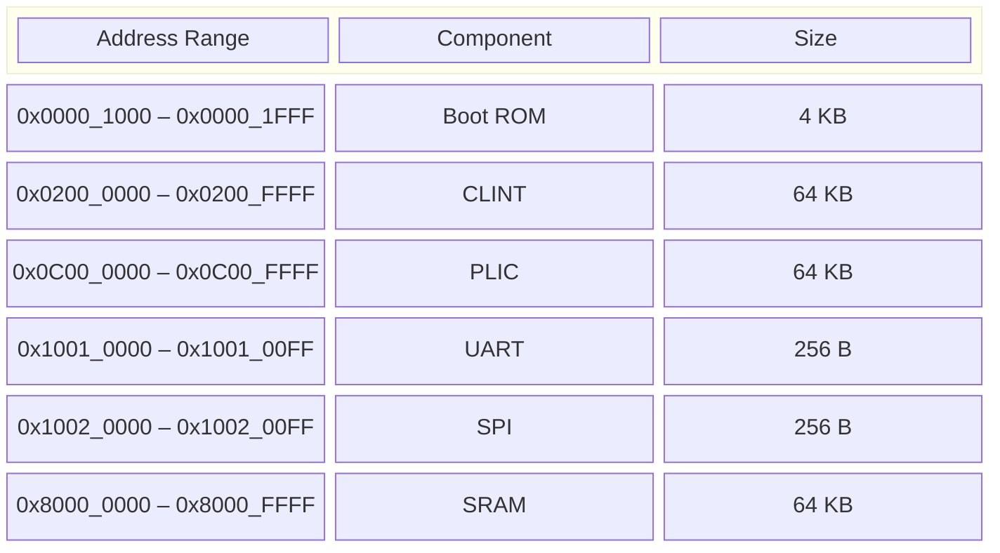
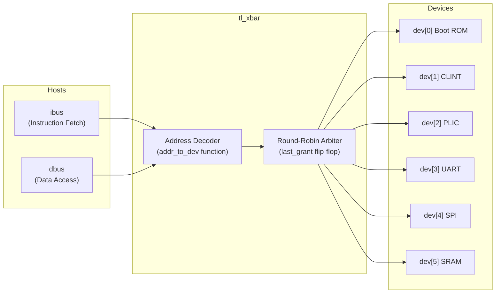
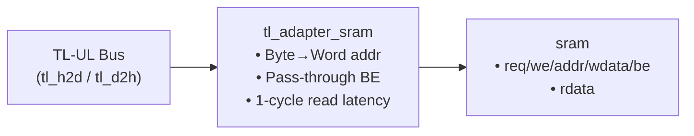

# Bus and Memory Architecture

This document covers the TileLink-UL interconnect, memory map, and the memory subsystems (SRAM and Boot ROM).

---

## TileLink-UL Protocol

The SoC uses a simplified **TileLink Uncached Lightweight (TL-UL)** bus protocol. All communication is point-to-point with valid/ready handshaking — a transfer occurs when **both** `valid` and `ready` are high on a clock edge.

### Bus Signal Definitions (`tl_ul_defs.svh`)

**Host-to-Device (`tl_h2d_t`):**

| Signal | Width | Description |
|--------|-------|-------------|
| `valid` | 1 | Request is valid |
| `we` | 1 | Write enable (0 = read, 1 = write) |
| `addr` | 32 | Byte address |
| `wdata` | 32 | Write data |
| `be` | 4 | Byte enables (one bit per byte lane) |

**Device-to-Host (`tl_d2h_t`):**

| Signal | Width | Description |
|--------|-------|-------------|
| `valid` | 1 | Response data is valid (for reads) |
| `ready` | 1 | Device is ready to accept requests |
| `rdata` | 32 | Read data |
| `error` | 1 | Error flag |

---

## Memory Map



| Device Index | Component | Base Address | End Address | Size | Access |
|:---:|-----------|-------------|-------------|------|--------|
| 0 | **Boot ROM** | `0x0000_1000` | `0x0000_1FFF` | 4 KB | Read-only |
| 1 | **CLINT** | `0x0200_0000` | `0x0200_FFFF` | 64 KB | Read/Write |
| 2 | **PLIC** | `0x0C00_0000` | `0x0C00_FFFF` | 64 KB | Read/Write |
| 3 | **UART** | `0x1001_0000` | `0x1001_00FF` | 256 B | Read/Write |
| 4 | **SPI** | `0x1002_0000` | `0x1002_00FF` | 256 B | Read/Write |
| 5 | **SRAM** | `0x8000_0000` | `0x8000_FFFF` | 64 KB | Read/Write |

Accesses to **unmapped addresses** return an error response: `rdata = 0xDEAD_BEEF`, `error = 1`.

---

## TileLink-UL Crossbar (`tl_xbar.sv`)

The crossbar connects 2 host ports to 6 device ports via address-based routing.

### Architecture



### Address Decoding Logic

The `addr_to_dev()` function maps addresses to device indices:

```systemverilog
if      (addr[31:12] == 20'h00001)   return 0;  // Boot ROM
else if (addr[31:16] == 16'h0200)    return 1;  // CLINT
else if (addr[31:16] == 16'h0C00)    return 2;  // PLIC
else if (addr[31:8]  == 24'h100100)  return 3;  // UART
else if (addr[31:8]  == 24'h100200)  return 4;  // SPI
else if (addr[31:16] == 16'h8000)    return 5;  // SRAM
else                                 return -1; // unmapped → error
```

### Arbitration

When both `ibus` and `dbus` attempt to access **the same device** in the same cycle:
- A **round-robin** arbiter (`last_grant` flip-flop) alternates priority between the two hosts.
- The losing host receives a stall response (`valid = 0`, `ready = 0`).

When there is **no contention** (different devices or only one active host), both requests are served simultaneously in the same cycle.

---

## Boot ROM (`boot_rom.sv`)

| Property | Value |
|----------|-------|
| **Base Address** | `0x0000_1000` |
| **Size** | 256 words × 32 bits = 1 KB actual, mapped across 4 KB |
| **Type** | Read-only |
| **Initialization** | `$readmemh(MEM_FILE, rom)` at elaboration time |
| **Latency** | 1 cycle (synchronous read for BRAM inference) |
| **Write behavior** | Returns `error = 1` on write attempts |

The Boot ROM contains the initial bootloader code that the CPU executes after reset (PC starts at `0x0000_1000`). The contents are loaded from a `.hex` file specified by the `BOOT_HEX` parameter.

**Word address extraction**: `word_addr = tl_h2d.addr[AW+1:2]` (divides byte address by 4).

---

## SRAM Subsystem

### TL-UL Adapter (`tl_adapter_sram.sv`)

Bridges the TileLink-UL protocol to the native SRAM interface:



| Conversion | Details |
|-----------|---------|
| Address | `sram_addr = tl_h2d.addr[ADDR_WIDTH+1:2]` (byte → word address) |
| Write | Direct pass-through of `wdata` and `be` |
| Read | `rsp_valid` is registered — read data available 1 cycle after request |
| Ready | Always `1` (SRAM never stalls) |

### SRAM (`sram.sv`)

| Property | Value |
|----------|-------|
| **Base Address** | `0x8000_0000` |
| **Size** | 2^14 words = 16,384 words = 64 KB |
| **Data Width** | 32 bits |
| **Address Width** | 14 bits (word address) |
| **Type** | Single-port read/write |
| **Byte-enable writes** | Per-byte write enable (4 bits) |
| **Inference** | `(* ram_style = "block" *)` attribute for Xilinx BRAM |
| **Read behavior** | Read-during-write returns old data (read-first) |

**Byte-enable write logic**: Each byte lane is independently writable:
```systemverilog
if (be[0]) mem[addr][7:0]   <= wdata[7:0];
if (be[1]) mem[addr][15:8]  <= wdata[15:8];
if (be[2]) mem[addr][23:16] <= wdata[23:16];
if (be[3]) mem[addr][31:24] <= wdata[31:24];
```
