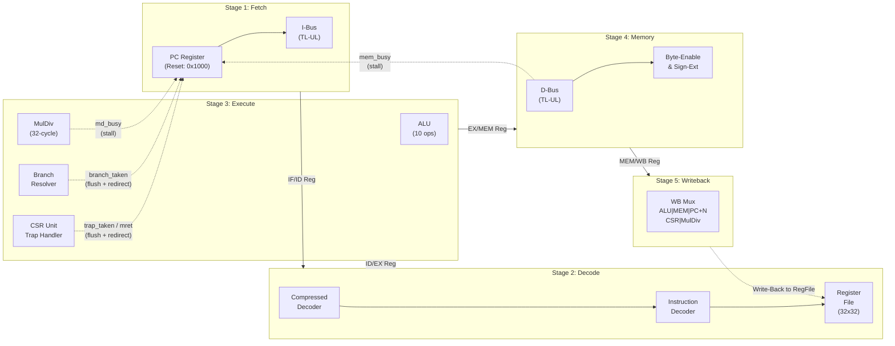
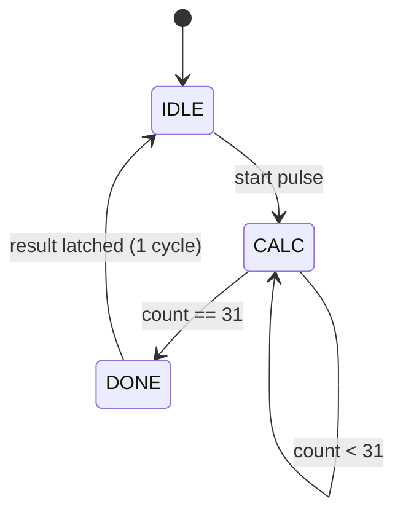
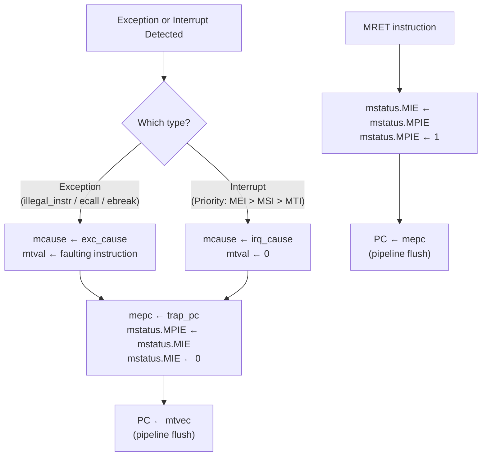

# CPU Core Architecture

The CPU core (`cpu_top.sv`) implements a classic **RV32IMC** 5-stage pipelined processor. It exposes two TileLink-UL bus master ports — one for instruction fetch (**ibus**) and one for data access (**dbus**) — and accepts three interrupt lines (`ext_irq`, `timer_irq`, `sw_irq`).

---

## Pipeline Architecture Diagram

## Pipeline Registers

Between each stage pair, there is a pipeline register that captures the control and data signals. All pipeline registers:
- **Reset** to safe defaults (NOP instruction `addi x0, x0, 0` = `0x00000013`).
- **Flush** to NOP on branch taken, trap entry, or `mret`.
- **Stall** (hold values) when `md_busy` or `mem_busy` is asserted.

| Register | Key Signals Carried |
|----------|-------------------|
| **IF/ID** | `pc`, `instr`, `valid` |
| **ID/EX** | `pc`, `rs1_data`, `rs2_data`, `imm`, `rd`, `rs1`, `rs2`, all control signals (`alu_op`, `md_op`, `mem_read/write`, `reg_write`, `wb_sel`, branch/CSR/exception flags), `is_compressed`, `valid` |
| **EX/MEM** | `alu_result`, `rs2_data` (store data), `pc_plus_n`, `rd`, memory control, `reg_write`, `wb_sel`, `csr_rdata`, `muldiv_result`, `valid` |
| **MEM/WB** | `alu_result`, `load_data`, `pc_plus_n`, `csr_rdata`, `muldiv_result`, `rd`, `reg_write`, `wb_sel` |

---

## Stage 1: Fetch (`fetch.sv`)

The Fetch stage maintains the **Program Counter (PC)** register and drives read requests to the instruction bus.

- **Reset Vector**: `0x0000_1000` (Boot ROM base address).
- **PC Incrementing**: 
  - Standard (32-bit) instructions: `PC + 4`.
  - Compressed (16-bit) instructions: `PC + 2`. Detected by checking `instr[1:0] != 2'b11`.
- **Redirection Priority** (handled in `cpu_top.sv`):
  1. `trap_taken` → PC = `trap_vector` (from CSR unit).
  2. `mret` → PC = `mepc` (from CSR unit).
  3. `branch_taken` → PC = `branch_target` (from Execute stage).
- **TL-UL Interface**: The fetch unit always drives `imem_h2d.valid = !stall` and `imem_h2d.we = 0` (read-only). The fetched instruction arrives in `imem_d2h.rdata`.

---

## Stage 2: Decode

### Compressed Decoder (`compressed_decoder.sv`)

Transparently expands 16-bit RV32C instructions into their 32-bit RV32I equivalents. If `instr[1:0] != 2'b11`, the instruction is compressed.

**Supported C-extension instructions (all 3 quadrants):**

| Quadrant | Instructions |
|----------|-------------|
| **C0** | `C.ADDI4SPN`, `C.LW`, `C.SW` |
| **C1** | `C.NOP`, `C.ADDI`, `C.JAL`, `C.LI`, `C.ADDI16SP`, `C.LUI`, `C.SRLI`, `C.SRAI`, `C.ANDI`, `C.SUB`, `C.XOR`, `C.OR`, `C.AND`, `C.J`, `C.BEQZ`, `C.BNEZ` |
| **C2** | `C.SLLI`, `C.LWSP`, `C.JR`, `C.MV`, `C.EBREAK`, `C.JALR`, `C.ADD`, `C.SWSP` |

The compressed register mapping uses `cr' = cr + 8` (registers `x8`–`x15`).

### Instruction Decoder (`decode.sv`)

A fully combinational decoder that takes the 32-bit (possibly expanded) instruction and generates all control signals for the pipeline.

**Instruction formats handled:**

| Format | Opcodes |
|--------|---------|
| **R-type** | `OP` (ADD, SUB, SLL, SLT, SLTU, XOR, SRL, SRA, OR, AND), M-extension (MUL, MULH, MULHSU, MULHU, DIV, DIVU, REM, REMU) |
| **I-type** | `OP-IMM` (ADDI, SLTI, SLTIU, XORI, ORI, ANDI, SLLI, SRLI, SRAI), `LOAD` (LB, LH, LW, LBU, LHU), `JALR` |
| **S-type** | `STORE` (SB, SH, SW) |
| **B-type** | `BRANCH` (BEQ, BNE, BLT, BGE, BLTU, BGEU) |
| **U-type** | `LUI`, `AUIPC` |
| **J-type** | `JAL` |
| **SYSTEM** | `CSRRW`, `CSRRS`, `CSRRC`, `CSRRWI`, `CSRRSI`, `CSRRCI`, `ECALL`, `EBREAK`, `MRET`, `FENCE` |

**Immediate generation** covers all 5 formats (I/S/B/U/J) with sign-extension.

### Register File (`regfile.sv`)

- 32 registers × 32 bits. Register `x0` is hardwired to zero.
- **2 asynchronous read ports** (for `rs1` and `rs2`).
- **1 synchronous write port** (from Writeback stage).
- **Write-first forwarding**: If the same register is being read and written in the same cycle, the **new** value is returned, avoiding a stale-read hazard.

---

## Stage 3: Execute

### ALU (`alu.sv`)

A purely combinational unit. Uses explicit carry-chain addition/subtraction (no `*` or `/` operators) for Vivado fast carry inference.

| Operation | Encoding | Description |
|-----------|----------|-------------|
| `ALU_ADD` | 4'd0 | `a + b` |
| `ALU_SUB` | 4'd1 | `a - b` (via 33-bit subtraction) |
| `ALU_AND` | 4'd2 | `a & b` |
| `ALU_OR` | 4'd3 | `a \| b` |
| `ALU_XOR` | 4'd4 | `a ^ b` |
| `ALU_SLL` | 4'd5 | `a << b[4:0]` |
| `ALU_SRL` | 4'd6 | `a >> b[4:0]` (logical) |
| `ALU_SRA` | 4'd7 | `a >>> b[4:0]` (arithmetic) |
| `ALU_SLT` | 4'd8 | Signed `a < b` ? 1 : 0 |
| `ALU_SLTU`| 4'd9 | Unsigned `a < b` ? 1 : 0 |
| `ALU_PASS_B` | 4'd10 | Pass `b` through (used by LUI) |

**Branch comparison outputs**: `cmp_eq`, `cmp_lt` (signed), `cmp_ltu` (unsigned). The signed comparison is overflow-aware: it checks sign bits first, then falls back to the subtraction result.

### Execute Stage Module (`execute.sv`)

**Operand muxing:**
- `alu_a`: Normally `rs1_data`. For `JAL` or `AUIPC`, it uses `pc`.
- `alu_b`: Uses `imm` when `alu_src_b_imm` is set, otherwise `rs2_data`.

**Branch target computation:**
- `JAL`: `pc + imm_j`
- `JALR`: `(rs1_data + imm_i) & ~1`
- `BRANCH`: `pc + imm_b`

**Branch resolution** uses ALU comparison flags:

| funct3 | Condition |
|--------|-----------|
| `BEQ` | `cmp_eq` |
| `BNE` | `!cmp_eq` |
| `BLT` | `cmp_lt` |
| `BGE` | `!cmp_lt` |
| `BLTU` | `cmp_ltu` |
| `BGEU` | `!cmp_ltu` |

**Link address**: For compressed instructions, the link address is `PC + 2` instead of `PC + 4`. This is resolved in `cpu_top.sv`.

### MulDiv Unit (`muldiv.sv`)

An iterative, multi-cycle unit with a simple **start/busy/valid** handshake.

**Algorithms:**
- **Multiplication**: Shift-and-add, 1 bit per cycle, 32 cycles.
- **Division**: Restoring division, 1 bit per cycle, 32 cycles.
- **Division by zero**: Returns `0xFFFFFFFF` for DIV/DIVU; returns the dividend for REM/REMU (no exception).

**Signed handling**: Operands are converted to absolute values; the result is negated at the end if needed, based on the original sign bits.

| Operation | Returns | Sign Correction |
|-----------|---------|-----------------|
| `MUL` | Lower 32 bits | None (unsigned multiply gives correct low word for signed) |
| `MULH` | Upper 32 bits | Negate if `sign(a) ⊕ sign(b)` |
| `MULHSU` | Upper 32 bits | Negate if `sign(a)` |
| `MULHU` | Upper 32 bits | None |
| `DIV` | Quotient (lower) | Negate if `sign(a) ⊕ sign(b)` |
| `DIVU` | Quotient (lower) | None |
| `REM` | Remainder (upper) | Negate if `sign(a)` |
| `REMU` | Remainder (upper) | None |

---

## Stage 4: Memory (`mem_stage.sv`)

Drives the TL-UL data bus for load/store operations. All addresses are **word-aligned** before being sent to the bus (`addr[31:2], 2'b00`).

**Byte-enable generation** based on `mem_funct3` and `addr[1:0]`:

| funct3 | Access Type | Byte Enables (depending on offset) |
|--------|-------------|-------------------------------------|
| `F3_BYTE` / `F3_BYTEU` | Byte | `0001`, `0010`, `0100`, `1000` |
| `F3_HALF` / `F3_HALFU` | Halfword | `0011`, `1100` |
| `F3_WORD` | Word | `1111` |

**Store data alignment**: The store data (`rs2`) is shifted to the correct byte lanes based on the byte offset.

**Load data extraction**: After reading the full 32-bit word from the bus, the correct byte(s) are extracted and sign/zero-extended:
- `LB`: 8-bit signed → 32-bit
- `LBU`: 8-bit unsigned → 32-bit
- `LH`: 16-bit signed → 32-bit
- `LHU`: 16-bit unsigned → 32-bit
- `LW`: 32-bit pass-through

**Stall signal**: `mem_busy = (mem_read || mem_write) && !dmem_d2h.ready`

---

## Stage 5: Writeback (`writeback.sv`)

A simple combinational mux selecting the final write-back value:

| `wb_sel` | Source | Used By |
|----------|--------|---------|
| `WB_ALU` (0) | ALU result | R-type arithmetic, I-type arithmetic, LUI, AUIPC |
| `WB_MEM` (1) | Memory load data | LB, LH, LW, LBU, LHU |
| `WB_PC4` (2) | PC + N (link) | JAL, JALR |
| `WB_CSR` (3) | CSR read data | CSRRW, CSRRS, CSRRC, CSRRWI, CSRRSI, CSRRCI |
| `WB_MULDIV` (4) | MulDiv result | MUL, MULH, MULHSU, MULHU, DIV, DIVU, REM, REMU |

---

## CSR Unit (`csr.sv`)

### Supported CSRs

| Address | Name | R/W | Description |
|---------|------|-----|-------------|
| `0x300` | `mstatus` | RW | Machine status (MIE[3], MPIE[7], MPP[12:11]) |
| `0x301` | `misa` | RO | ISA description: RV32IMC (`MXL=01`, `I=1`, `M=1`, `C=1`) |
| `0x304` | `mie` | RW | Interrupt enables (MSIE[3], MTIE[7], MEIE[11]) |
| `0x305` | `mtvec` | RW | Trap vector base address (forced word-aligned) |
| `0x340` | `mscratch` | RW | Scratch register for trap handlers |
| `0x341` | `mepc` | RW | Exception PC (forced half-word aligned for C-ext) |
| `0x342` | `mcause` | RW | Trap cause code |
| `0x343` | `mtval` | RW | Trap value (faulting instruction or address) |
| `0x344` | `mip` | RO | Interrupt pending (MSIP[3], MTIP[7], MEIP[11]) — driven by hardware |
| `0xB00` | `mcycle` | RO | Cycle counter (lower 32) |
| `0xB80` | `mcycleh` | RO | Cycle counter (upper 32) |
| `0xB02` | `minstret` | RO | Retired instruction counter (lower 32) |
| `0xB82` | `minstreth` | RO | Retired instruction counter (upper 32) |
| `0xF11` | `mvendorid` | RO | Vendor ID (returns 0) |
| `0xF12` | `marchid` | RO | Architecture ID (returns 0) |
| `0xF13` | `mimpid` | RO | Implementation ID (returns 0) |
| `0xF14` | `mhartid` | RO | Hart ID (returns 0) |

### CSR Instructions

| Instruction | Operation |
|-------------|-----------|
| `CSRRW` | Write `rs1` to CSR; old value → `rd` |
| `CSRRS` | Set bits: CSR = CSR \| rs1; old value → `rd` |
| `CSRRC` | Clear bits: CSR = CSR & ~rs1; old value → `rd` |
| `CSRRWI` | Write `zimm` to CSR; old value → `rd` |
| `CSRRSI` | Set bits with `zimm`; old value → `rd` |
| `CSRRCI` | Clear bits with `zimm`; old value → `rd` |

### Trap Handling Flow

**Interrupt priority** (highest to lowest): Machine External (MEI) → Machine Software (MSI) → Machine Timer (MTI). Interrupts are only taken when `mstatus.MIE = 1` and the corresponding bit is set in both `mie` and `mip`.

### Exception Cause Codes

| Code | Name | Trigger |
|------|------|---------|
| 0 | Instruction address misaligned | (defined but not generated in current implementation) |
| 2 | Illegal instruction | Unrecognized opcode or C-extension encoding |
| 3 | Breakpoint | `EBREAK` instruction |
| 4 | Load address misaligned | (defined but not generated in current implementation) |
| 6 | Store address misaligned | (defined but not generated in current implementation) |
| 11 | Environment call from M-mode | `ECALL` instruction |

### Interrupt Cause Codes

| Code | Name | Source |
|------|------|--------|
| `{1'b1, 31'd3}` | Machine software interrupt | CLINT `msip` |
| `{1'b1, 31'd7}` | Machine timer interrupt | CLINT `mtime >= mtimecmp` |
| `{1'b1, 31'd11}` | Machine external interrupt | PLIC `ext_irq` |

---

## Hazard Control Summary

| Condition | Effect | Duration |
|-----------|--------|----------|
| `md_busy` (MulDiv computing) | **Stall** all stages | Until `md_valid` (32 cycles) |
| `mem_busy` (device not ready) | **Stall** all stages | Until `dmem_d2h.ready` |
| `branch_taken` | **Flush** IF/ID and ID/EX | 1 cycle |
| `trap_taken` | **Flush** IF/ID and ID/EX | 1 cycle |
| `mret` | **Flush** IF/ID and ID/EX | 1 cycle |

> **Note**: This pipeline does **not** implement data forwarding/bypassing. The register file's write-first forwarding mitigates some RAW hazards, but software should be aware of potential pipeline hazards for back-to-back dependent instructions.
