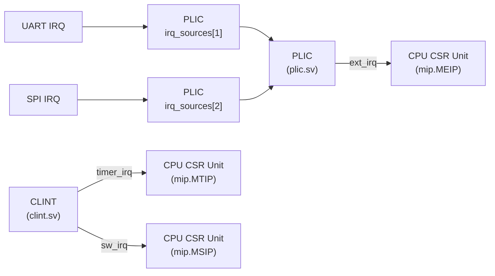
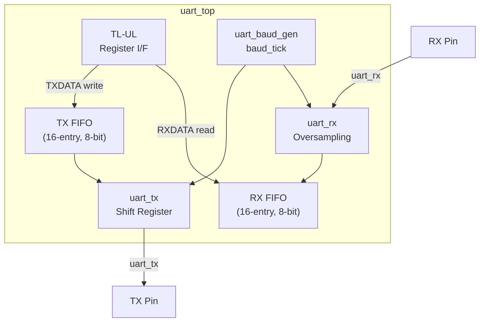
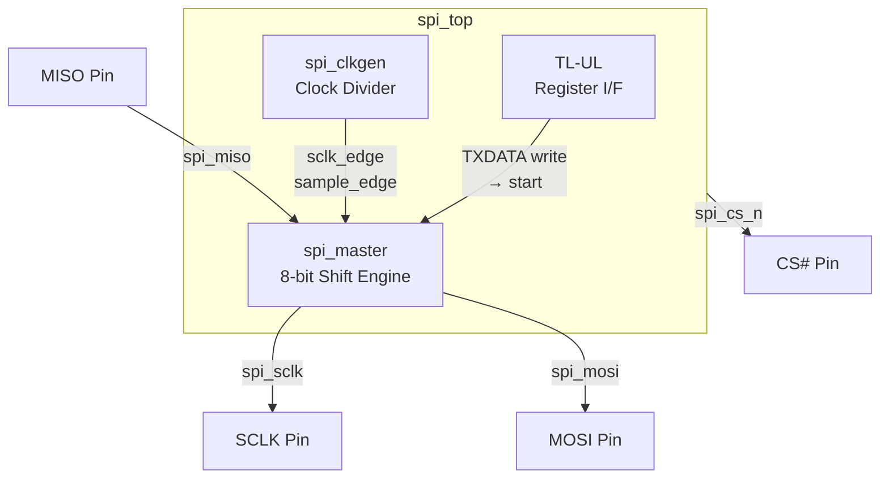
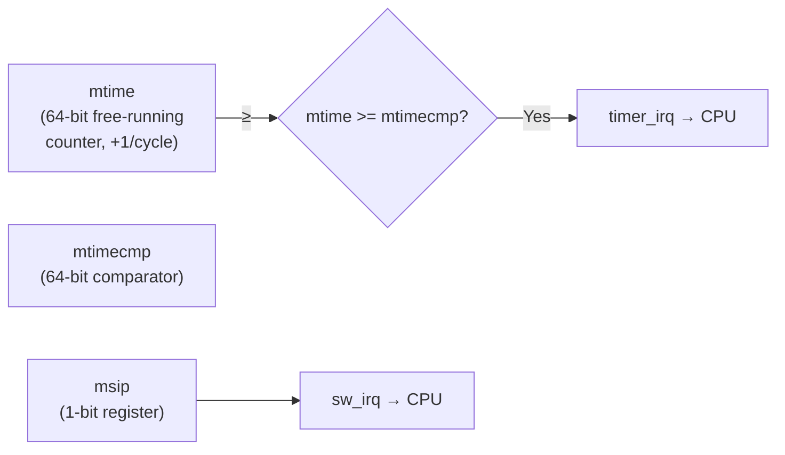
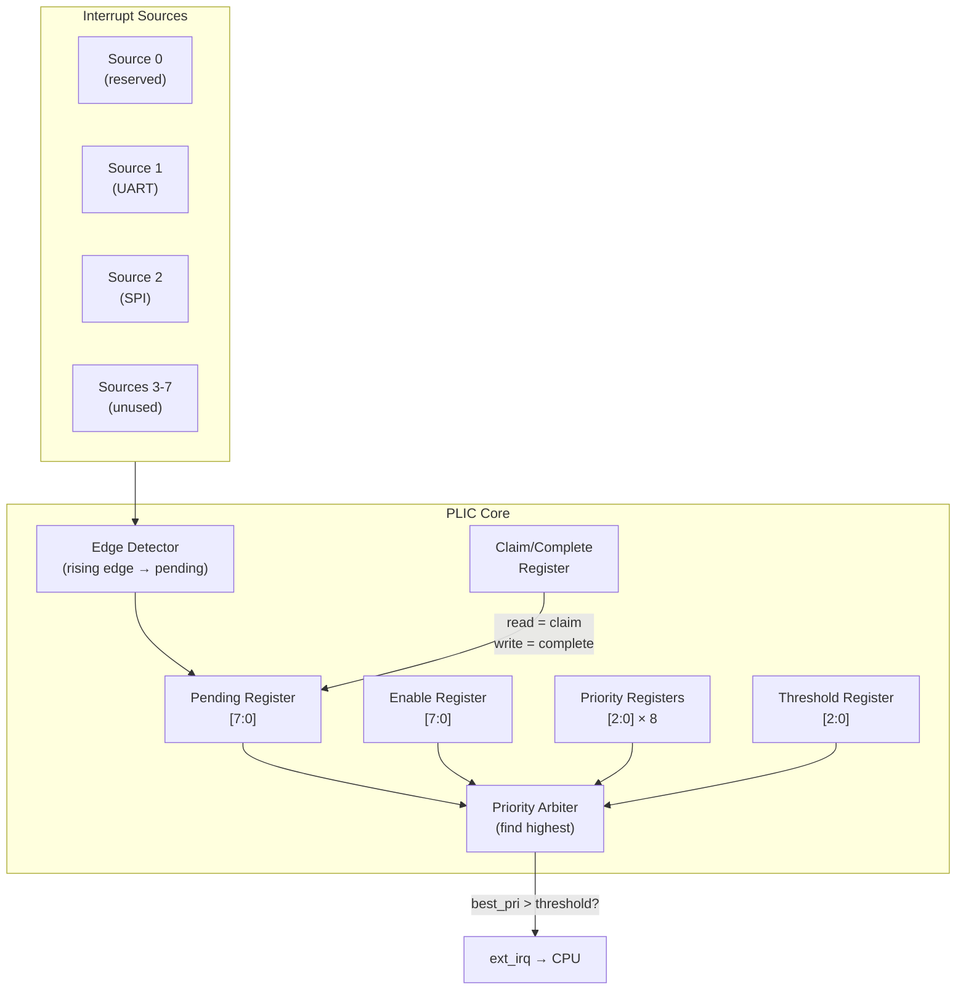

# Peripherals

This document covers the four peripheral controllers integrated into the SoC: **UART**, **SPI**, **CLINT** (Core Local Interruptor), and **PLIC** (Platform-Level Interrupt Controller).

---

## Interrupt Architecture

The PLIC sources are wired as: `plic_sources = {5'b0, spi_irq, uart_irq, 1'b0}` (source 0 is reserved, source 1 = UART, source 2 = SPI, sources 3–7 unused).

---

## UART Controller

**Base address**: `0x1001_0000`  
**Files**: `uart_top.sv`, `uart_baud_gen.sv`, `uart_fifo.sv`, `uart_tx.sv`, `uart_rx.sv`  
**Default**: 115200 baud, 8N1

### Block Diagram

### Register Map

| Offset | Name | Access | Bits | Description |
|--------|------|--------|------|-------------|
| `0x00` | **TXDATA** | W | `[7:0]` | Write a byte to TX FIFO (ignored if FIFO full) |
| `0x04` | **RXDATA** | R | `[7:0]` | Read a byte from RX FIFO (pops on read) |
| `0x08` | **STATUS** | R | `[3:0]` | `[0]` tx_full, `[1]` tx_empty, `[2]` rx_full, `[3]` rx_empty |
| `0x0C` | **CTRL** | RW | `[17:0]` | `[15:0]` baud divisor, `[16]` tx_ie (TX interrupt enable), `[17]` rx_ie (RX interrupt enable) |
| `0x10` | **IP** | R | `[1:0]` | `[0]` tx_irq (TX FIFO empty & tx_ie), `[1]` rx_irq (RX FIFO has data & rx_ie) |

### Interrupt Logic

| IRQ | Condition |
|-----|-----------|
| `tx_irq` | `tx_ie && tx_fifo_empty` — TX FIFO has drained |
| `rx_irq` | `rx_ie && !rx_fifo_empty` — RX FIFO has data |
| `irq` (combined) | `tx_irq \|\| rx_irq` |

### FIFO Details

- **Depth**: 16 entries
- **Width**: 8 bits
- **TX flow**: Write `TXDATA` → pushed into TX FIFO → `uart_tx` pops when `!tx_busy && !tx_fifo_empty` → serial shift out
- **RX flow**: `uart_rx` samples → `rx_byte_valid` pulse → pushed into RX FIFO → software reads `RXDATA` (auto-pops)

### Baud Rate

The baud rate is determined by the `uart_baud_gen` module using default parameters (`CLK_FREQ` and `BAUD_RATE`). The `CTRL` register's `baud_div` field allows runtime override.

---

## SPI Controller

**Base address**: `0x1002_0000`  
**Files**: `spi_top.sv`, `spi_clkgen.sv`, `spi_master.sv`  
**Mode**: Master only, 8-bit transfers

### Block Diagram

### Register Map

| Offset | Name | Access | Bits | Description |
|--------|------|--------|------|-------------|
| `0x00` | **TXDATA** | W | `[7:0]` | Write byte to transmit (starts transfer if not busy) |
| `0x04` | **RXDATA** | R | `[7:0]` | Last received byte |
| `0x08` | **STATUS** | R/W1C | `[1:0]` | `[0]` busy, `[1]` done (write 1 to clear done flag) |
| `0x0C` | **CTRL** | RW | `[10:0]` | `[7:0]` clock divisor, `[8]` CPOL, `[9]` CPHA, `[10]` IE (interrupt enable) |

### Transfer Sequence

1. Software writes `CTRL` to configure clock divisor, CPOL, CPHA.
2. Software writes `TXDATA` with the byte to transmit.
3. Hardware asserts `spi_cs_n = 0` and starts shifting.
4. After 8 bits, `done_flag` is set; `spi_cs_n` is deasserted.
5. Software reads `RXDATA` for the received byte.
6. Optionally, software clears `done_flag` by writing `1` to `STATUS[1]`.

### Interrupt Logic

| IRQ | Condition |
|-----|-----------|
| `irq` | `ie && done_flag` — transfer completed and interrupts enabled |

### SPI Modes Support

| CPOL | CPHA | Mode | Description |
|------|------|------|-------------|
| 0 | 0 | 0 | Clock idle low, sample on leading edge |
| 0 | 1 | 1 | Clock idle low, sample on trailing edge |
| 1 | 0 | 2 | Clock idle high, sample on leading edge |
| 1 | 1 | 3 | Clock idle high, sample on trailing edge |

---

## CLINT — Core Local Interruptor

**Base address**: `0x0200_0000`  
**File**: `clint.sv`

The CLINT provides the standard RISC-V machine-mode timer and software interrupt facilities.

### Block Diagram

### Register Map

| Offset | Name | Access | Width | Description |
|--------|------|--------|-------|-------------|
| `0x0000` | **msip** | RW | `[0]` | Machine software interrupt pending. Write `1` to trigger, `0` to clear. |
| `0x4000` | **mtimecmp** | RW | 32 | Timer compare value (lower 32 bits) |
| `0x4004` | **mtimecmph** | RW | 32 | Timer compare value (upper 32 bits) |
| `0xBFF8` | **mtime** | RO | 32 | Current timer value (lower 32 bits). Read-only; increments every clock cycle. |
| `0xBFFC` | **mtimeh** | RO | 32 | Current timer value (upper 32 bits) |

> **Note**: The register offsets follow the RISC-V CLINT specification layout. The `mtime` counter is **read-only** and cannot be written by software.

### Interrupt Generation

- **Timer IRQ**: `timer_irq = (mtime >= mtimecmp)` — asserted continuously while the condition is true. Software should write a new value to `mtimecmp` to clear.
- **Software IRQ**: `sw_irq = msip[0]` — directly controlled by software.
- **Reset**: `mtimecmp` resets to `0xFFFFFFFF_FFFFFFFF` (no timer interrupt on reset).

---

## PLIC — Platform-Level Interrupt Controller

**Base address**: `0x0C00_0000`  
**File**: `plic.sv`  
**Configuration**: 8 interrupt sources, 7 priority levels

The PLIC receives external interrupt signals, prioritizes them, and presents the highest-priority pending interrupt to the CPU as `ext_irq`.

### Block Diagram

### Register Map

| Offset | Name | Access | Description |
|--------|------|--------|-------------|
| `0x004` | **priority[1]** | RW | Source 1 priority (3 bits, 0–7). Higher = higher priority. |
| `0x008` | **priority[2]** | RW | Source 2 priority |
| ... | **priority[3–7]** | RW | Sources 3–7 priority |
| `0x080` | **pending** | R | Pending bits `[7:0]` — set on rising edge of interrupt source |
| `0x100` | **enable** | RW | Enable bits `[7:0]` — enable/disable individual sources |
| `0x200` | **threshold** | RW | Priority threshold (3 bits). Only interrupts with priority > threshold are signaled. |
| `0x204` | **claim/complete** | R/W | **Read**: Returns ID of highest-priority pending & enabled interrupt (claim). Clears pending bit. **Write**: Completes the interrupt (software acknowledgment). |

### Interrupt Flow

1. External source asserts its interrupt line (e.g., UART finishes a transfer).
2. PLIC detects the **rising edge** and sets the corresponding **pending** bit.
3. The priority arbiter scans all pending & enabled sources for the one with the highest priority.
4. If `best_priority > threshold`, the PLIC asserts `ext_irq` to the CPU.
5. The CPU's CSR unit sees `mip.MEIP` and (if `mstatus.MIE` and `mie.MEIE` are set) takes the trap.
6. The trap handler **reads** `claim/complete` → gets the interrupt source ID → pending bit is cleared.
7. The handler services the interrupt, then **writes** `claim/complete` to acknowledge.

### Priority Rules

- Priority `0` effectively disables the source (it will never win arbitration).
- If multiple sources have equal priority, the **lowest-numbered** source wins (due to sequential scan order in the arbiter).
- Source 0 is **reserved** and never participates in arbitration.
