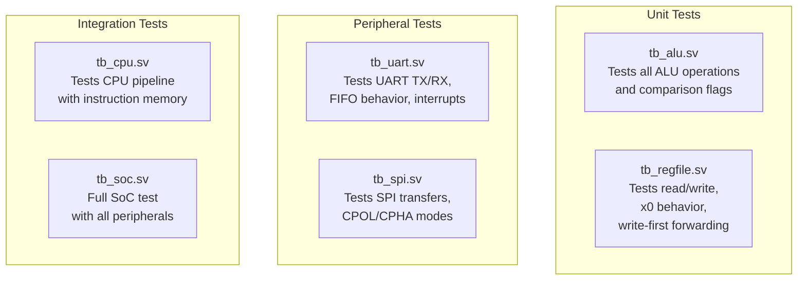

# Simulation & Testing

This document describes the testbenches available in the `tb/` directory and how to use them to verify the SoC.

---

## Testbench Overview



| Testbench | File | Tests | DUT |
|-----------|------|-------|-----|
| **ALU** | `tb_alu.sv` | All 10 ALU operations, comparison output flags | `alu` |
| **Register File** | `tb_regfile.sv` | Read/write, `x0` hardwired zero, write-first forwarding | `regfile` |
| **UART** | `tb_uart.sv` | TX FIFO push, serial output, RX path, register readback | `uart_top` |
| **SPI** | `tb_spi.sv` | SPI master transfers, CPOL/CPHA modes, done flag, readback | `spi_top` |
| **CPU** | `tb_cpu.sv` | Pipeline execution with memory-backed instruction fetches | `cpu_top` |
| **SoC** | `tb_soc.sv` | Full system with all peripherals, boot from ROM, SRAM access | `soc_top` |

---

## Running Testbenches in Vivado Simulator

### Setup

1. **Create a Vivado project** (or use an existing one).
2. **Add design sources**: Add all files from `rtl/` recursively.
3. **Set include directory**: In project settings → Simulation → Include Directories, add:
   ```
   rtl/include
   ```
4. **Add simulation source**: Add the desired testbench file from `tb/`.

### Running a Specific Testbench

1. Open Vivado GUI → **Flow Navigator** → **Simulation** → **Run Simulation** → **Run Behavioral Simulation**.
2. Set the **top module** to the desired testbench:
   - `tb_alu` for ALU unit test
   - `tb_regfile` for register file unit test
   - `tb_uart` for UART peripheral test
   - `tb_spi` for SPI peripheral test
   - `tb_cpu` for CPU integration test
   - `tb_soc` for full SoC integration test
3. Click **Run** to start the simulation.

### TCL Console (Alternative)

```tcl
# Set the top module
set_property top tb_soc [get_filesets sim_1]

# Launch simulation
launch_simulation

# Run for a specific duration
run 100us

# Or run all
run -all
```

---

## Testbench Details

### `tb_alu.sv` — ALU Unit Test

Tests all 10 ALU operations defined in `alu_op_t`:
- Arithmetic: `ADD`, `SUB`
- Logical: `AND`, `OR`, `XOR`
- Shift: `SLL`, `SRL`, `SRA`
- Comparison: `SLT`, `SLTU`
- Pass-through: `PASS_B`

Also validates the comparison output flags (`cmp_eq`, `cmp_lt`, `cmp_ltu`) used by the branch resolver.

### `tb_regfile.sv` — Register File Unit Test

Verifies:
- Writing and reading back arbitrary registers
- `x0` always reads as zero regardless of writes
- **Write-first forwarding**: When reading and writing the same register in the same cycle, the new (written) value is returned

### `tb_uart.sv` — UART Peripheral Test

Tests the full UART data path:
- Writing bytes to `TXDATA` and monitoring the `uart_tx` serial line
- Driving `uart_rx` with a serial byte stream and reading `RXDATA`
- Checking `STATUS` register for FIFO full/empty flags
- Verifying interrupt generation based on `CTRL` interrupt enables

### `tb_spi.sv` — SPI Peripheral Test

Tests the SPI master:
- Writing `CTRL` to set clock divisor, CPOL, CPHA
- Writing `TXDATA` to initiate a transfer
- Monitoring `spi_sclk`, `spi_mosi`, `spi_cs_n` waveforms
- Driving `spi_miso` to simulate a slave response
- Reading `RXDATA` and `STATUS` registers

### `tb_cpu.sv` — CPU Integration Test

Tests the CPU pipeline with memory-backed instruction and data buses:
- Loads instructions into memory
- Verifies correct execution through register file state
- Tests branch, jump, load/store sequences
- Tests trap and interrupt handling

### `tb_soc.sv` — Full SoC Integration Test

End-to-end test of the entire SoC:
- Boot from ROM at `0x0000_1000`
- Execute instructions from SRAM at `0x8000_0000`
- Test peripheral register access (UART, SPI)
- Verify timer and interrupt behavior (CLINT, PLIC)

---

## Tips

- **Waveform debugging**: After running a simulation, use the Vivado waveform viewer to inspect signals. Key signals to watch:
  - `u_cpu/f_pc` — current Fetch PC
  - `u_cpu/id_instr` — decoded instruction
  - `u_cpu/wb_data` — writeback data
  - `u_cpu/wb_rd` — destination register
  - `u_cpu/stall`, `u_cpu/flush` — pipeline control
- **Boot ROM contents**: Ensure the `BOOT_HEX` parameter points to a valid `.hex` file. For `tb_soc`, the testbench may override this or provide a default.
- **Simulation time**: For UART tests, baud rate timing means you may need to simulate for 100µs+ to see complete byte transfers at 115200 baud.
